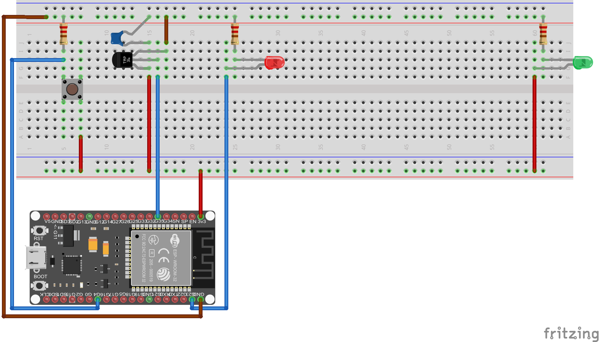

# IOT_Board

A simple temperature sensing device that transmits values over MQTT.

### Configure the project

```
make menuconfig
```
* Set serialport under ``Serial flasher config``
* Set wifi SSID, password, MQTT Broker URL & Device name under ``Custom Network etc. Configuration``  

### Build and Flash

Build the project and flash it to the board, then run monitor tool to view serial output:

```
make -j4 flash monitor
```

(To exit the serial monitor, type ``Ctrl-]``.)

## Prototype:
 * Breadboard
 * ESP32 DEVKIT board
 * TMP36 temperature sensor
 * Ceramic capacitor [0.1µF]
 * 2x LEDs
 * Pushbutton
 * Resistors [100Ω, 2 x 220Ω]

 
